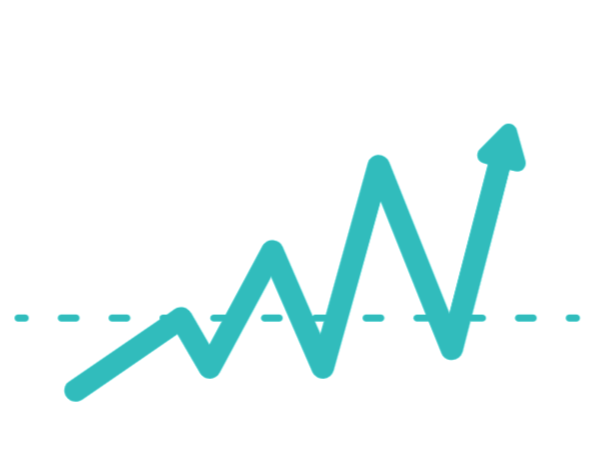

<!-- PROJECT LOGO -->
<br />
<p align="center">
  <a href="https://github.com/rooneyshuman/dollar-tracker">
    
  </a>

  <h3 align="center">Dollar Tracker</h3>

  <p align="center">
    Display a user's personal financial dashboard.
    <br />
    <a href="https://github.com/rooneyshuman/dollar-tracker"><strong>Explore the docs »</strong></a>
    <br />
    <br />
    <a href="https://github.com/rooneyshuman/dollar-tracker">View Demo</a>
    ·
    <a href="https://github.com/rooneyshuman/dollar-tracker/issues">Report Bug</a>
    ·
    <a href="https://github.com/rooneyshuman/dollar-tracker/issues">Request Feature</a>
  </p>
</p>

<!-- TABLE OF CONTENTS -->
## Table of Contents

* [About the Project](#about-the-project)
  * [Built With](#built-with)
* [Getting Started](#getting-started)
  * [Prerequisites](#prerequisites)
  * [Installation](#installation)
* [Deployment](#deployment)
* [Contributing](#contributing)
* [Contributors](#contributors)
* [License](#license)
* [Acknowledgements](#acknowledgements)

## About the Project

This frontend dashboard application displays a user’s personal financial transactions, links bank accounts, stock news, and tracks investment information such as stock prices. 

### Built With

| Frontend  | Backend |
| ------------- | ------------- |
| HTML5  | Python |
| CSS3  | Flask |
| Bootstrap | [Plaid API](https://plaid.com/) |
| Jinja | [pyEX](https://github.com/timkpaine/pyEX) |

## Getting Started

Folow these instructions to get a local copy of this application up and running.

### Prerequisites

* Python 3
* pip
* virtualenv

### Installation

1. Clone the repo

```
git clone https://github.com/rooneyshuman/dollar-tracker
```

2. Build the project
```
python3 -m venv env
source env/bin/activate
pip install -r requirements.txt
```

3. Run the project
```
python app.py
```

## Deployment 

Dollar Tracker is deployed to: https://dollar-tracker.herokuapp.com/

## Contributing
Contributions are what make the open source community such an amazing place to learn, inspire, and create. Any contributions you make are **greatly appreciated**. 

1. Fork the project
2. Create your feature branch (`git checkout -b feature/AmazingFeature`)
3. Commit your changes (`git commit -m 'Add some AmazingFeature'`)
4. Push to the branch (`git push origin feature/AmazingFeature`)
5. Open a pull request

## Contributors

* [Belén](https://github.com/rooneyshuman/) 
* [Carissa](https://github.com/carissaallen)  
* [David](https://github.com/dmunozc)

## License

Distributed under the MIT License. See [LICENSE.md](https://github.com/rooneyshuman/dollar-tracker/blob/master/LICENSE) for more information.

## Acknowledgements
* [README Inspiration](https://github.com/carissaallen/Best-README-Template)
* Design based on an example provided in the instructor's project description
